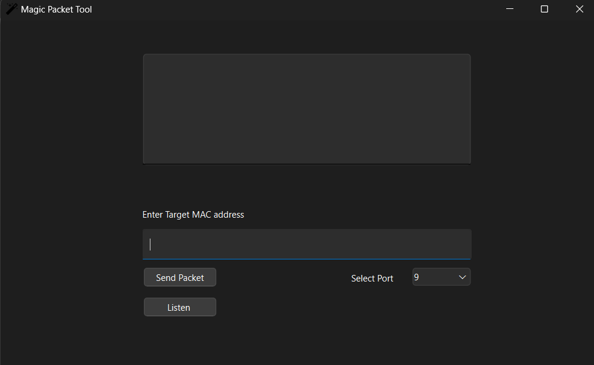

# Magic Packet Tool

## Overview

The **Magic Packet Tool** is a utility designed to assist in the testing and sending of Wake-on-LAN (WoL) and Wake-on-WLAN (WoWLAN) magic packets. Magic packets are special data packets sent over a network to trigger the startup of a computer in a low-power state. This tool helps network administrators, IT professionals, and enthusiasts verify that the magic packets are correctly sent and received, ensuring that their network setups, including firewalls and routers, are properly configured to allow these packets through.

## Features

- **Send Magic Packets**: Easily send a magic packet to a target computer by specifying its MAC address.
- **Listen for Magic Packets**: Test if a magic packet is received on a specific port, confirming that the target computer can be awakened over the network.
- **Port Selection**: Choose between ports 7 and 9, which are commonly used for WoL/WoWLAN.
- **User-Friendly Interface**: Simple and intuitive GUI to make sending and listening for magic packets straightforward.

## Usage

1. **Enter Target MAC Address**: Input the MAC address of the computer you wish to wake up. Ensure the MAC address is in the correct format, without any delimiters (e.g., `0050B674D512`).

2. **Select Port**: Use the drop-down menu to select the port (7 or 9) you want to use for sending or receiving magic packets.

3. **Send Packet**: Click the "Send Packet" button to broadcast a magic packet to the specified MAC address.

4. **Listen**: Click the "Listen" button to start listening for incoming magic packets on the selected port. This helps in verifying whether the packet is successfully received by the target machine.

## Purpose

This tool is particularly useful in scenarios where you have set up Wake-on-LAN or Wake-on-WLAN but are unsure if your network configuration allows the magic packet to reach the target device. Firewalls, routers, and network configurations can sometimes block these packets, making it essential to test the setup.

With this tool, you can confirm whether the magic packet is received by the target computer, helping to troubleshoot and ensure that your WoL/WoWLAN configuration is working correctly.

## Installation

To use the Magic Packet Tool, you can download the executable from the [Releases](#) section on GitHub (link to be added after uploading). Ensure that the necessary dependencies (DLL files) are included in the same directory as the executable.

For developers who wish to modify or extend the tool, the source code is available in this repository. You can compile it using Qt Creator.

## Contribution

Contributions are welcome! If you find a bug or have an enhancement idea, feel free to open an issue or submit a pull request.

## License

This project is licensed under the MIT License. See the [LICENSE](./LICENSE) file for details.
